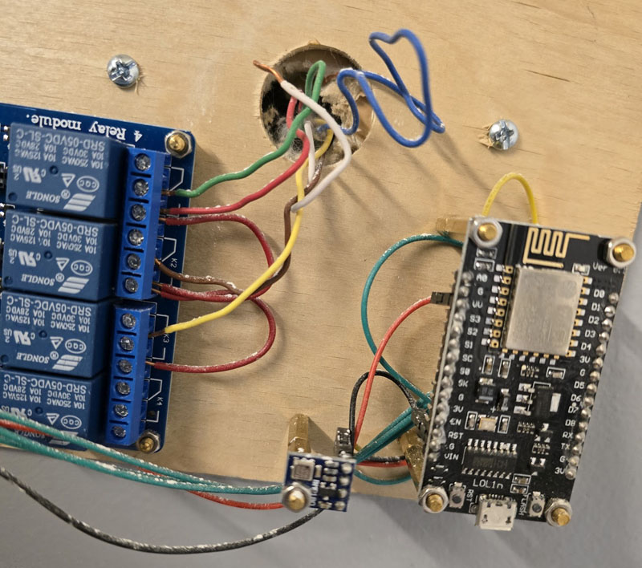
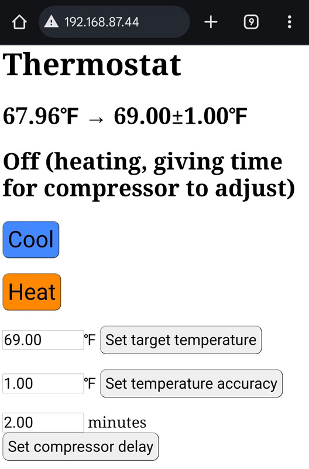

# ESP-based heat pump thermostat

This project is a simple thermostat designed for an ESP8266 or ESP32 connected to three active-low relays controlling a heat pump's fan, reversing valve, and compressor (see [HVAC.ino](HVAC.ino)), and connected to a BMP180.  Control of the thermostat is via a web interface provided by the microcontroller.





## Connecting to WiFi

The SSID and password of the WiFi network are included in Private.h (excluded from this repository) which defines:

```c
const char *ssid = "Name of SSID";
const char *password = "Password";
```
